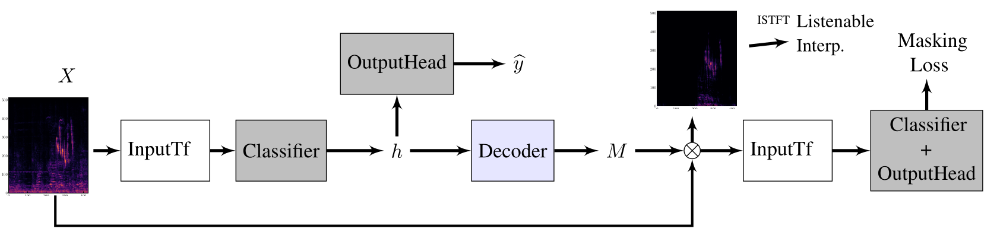

# Artykuł 1. – Sanity Ckecks for Saliency Maps

- link do artykułu: [https://arxiv.org/pdf/1810.03292](https://arxiv.org/pdf/1810.03292),
- link do kodu eksperymentów: [https://github.com/adebayoj/sanity_checks_saliency](https://github.com/adebayoj/sanity_checks_saliency).

## Problem
* istnieje wiele metod atrybucji, saliency – wskazują one które fragmenty danych wpłynęły na decyzję algorytmu AI,
* wyjaśnienia mogą pomóc w debugowaniu modelu, wykryć bias lub niezamierzone zachowanie wyuczone przez model,
* jednak nie wiadomo dokładnie w jaki sposób mierzyć jakość tych wyjaśnień – czy są poprawne, czy tylko dobrze wyglądają:
    * niektóre popularne metody XAI działają w sposób niezależny od tego czego nauczył się model oraz niezależny od samych danych,
    * niektóre mapy atrybucji wyglądają niemal identycznie jak wynik zwykłego detektora krawędzi – model zamiast faktycznie identyfikować obiekt, może po prostu wyciągać z obrazka jego strukturę.

## Metodologia zaproponowana przez autorów
* autorzy proponują metodologię opartą na testach randomizacyjnych, a dokładnie dwie instancje testów:
    - Model Parameter Randomization Test (MPRT),
    - Data Randomization Test (DRT),
* jeżeli okaże się, że jakaś metoda jest niezmienna względem wag, to zastosowanie tej metody w celu np. debugowania modelu będzie bez sensu.

### Model Parameter Randomization Test

- porównywane są wyniki metod saliency na wytrenowanym modelu, z wynikami tych metod na modelach tej samej architektury o zrandomizowanych parametrach,
- jeżeli dana metoda saliency zależy od wyuczonych parametrów modelu, wynik powinien się znacząco różnić,
- jeżeli wyniki będą podobne – można wnioskować, że dana metoda nie jest zależna od parametrów modelu, że nie nada się do zadań wyjaśniania modelu,
- autorzy przeprowadzają dwa rodzaje randomizacji:
    - kaskadową:
        - zaczynają od wytrenowanego modelu i reinicjalizują wagi kaskadowo od góry do dołu, od pierwszej warstwy do ostatniej,
        - na każdym kroku obliczają mapę atrybucji i porównują ją z oryginałem,
        - otrzymują w ten sposób krzywą degradacji – jak mapa się zmienia w miarę niszczenia coraz większej części modelu,
        - jeśli metoda jest wrażliwa, krzywa powinna stopniowo spadać do 0,
    - niezależną:
        - reinicjalizują jedną warstwę na raz, reszta pozostaje nietknięta,
        - po randomizacji danej warstwy wyznaczają mapę i porównują ją z oryginałem,
        - pozwala to wyizolować wpływ poszczególnych warstw, można zobaczyć, czy mapa atrybucji zależy bardziej od warstw niższych, czy wyższych,
- stosowane metryki do porównywania map:
    - korelacja rangowa Spearmana,
    - HOGs – histogram of oriented gradient,
    - SSIM – structural similarity index,
- wyniki eksperymentów pokazały, że Guided BackProp i Guided GradCAM nie zmieniają się niezależnie od degradacji modelu,

### Data Randomization Test
- porównuje daną metodę saliency wykorzystaną na modelu wytrenowanym na poprawnie zaetykietowanych danych z tą samą metodą wykorzystaną na modelu o tej samej architekturze, ale wyuczonym na kopii zbioru treningowego z losowo pozamienianymi etykietami,
- jeżeli dana metoda zależy od poprawnego etykietowania – wyniki powinny się znacząco różnić niż w przypadku gdy etykiety będą pozamieniane,
- eksperyment ten ewaluuje czułość danej metody XAI na relację pomiędzy przykładami a ich etykietami,
- autorzy losowo permutują etykiety w zbiorze treningowym i trenują model od zera aż zacznie uzyskiwać 95% dokładności na zbiorze treningowym, aż model na pamięć zapamięta większość błędnych etykiet, 
- następnie porównują uzyskane mapy wyjaśnień na poprawnie wytrenowanym modelu i tym wytrenowanym na losowych etykietach.

## Modele użyte w eksperymentach
- Inception v3 wytrenowany na ImageNet,
- CNN wytrenowany na MNIST i Fashion MNIST,
- MLP wytrenowany na MNIST,
- Inception v4 wytrenowany ma Skeletal Radiograms.

## Najważniejsze wnioski
- architektura sieci neuronowej ma duży wpływ na reprezentacje pochodzące z sieci:
    - sama architektura może wymuszać na modelu szukania lokalnych wzorców jak np. CNN,
    - nawet jeśli wagi są losowe CNN działa jak filtr, który przepuszcza określone kształty,
- losowo zainicjalizowana sieć nie jest całkowicie głupia:
    - posiada pewne wstepne założenia / predyspozycje (priors) do rozpoznawania określonych struktur,
    - jest w stanie generować nietrywialne reprezentacje tego co widzi, a nie tylko losowy szum,
    - można jej użyć do pewnych zadań takich jak odszumianie czy super resolution,
- wyjaśnienia które nie zależą od parametrów modelu czy danych treningowych nadal mogą być przydatne do zrozumienia priors wynikających z samej architektury modelu,
- wiele metod z rodziny saliency sprowadza się do przemnożenia wejściowego obrazu przez gradient:
    - okazuje się, że obraz wejściowy dominuje gradient w tym mnożeniu,
    - metody typu LRP mogą w rzeczywistości zwracać po prostu lekko zmodyfikowany obrazek wejściowy, a nie wyjaśnienie decyzji modelu.

# Artykuł 2. - A Fresh Look at Sanity Checks for Saliency Maps

- link do artykułu: [https://arxiv.org/pdf/2405.02383](https://arxiv.org/pdf/2405.02383),
- link do kodu eksperymentów: [https://github.com/annahedstroem/sanity-checks-revisited](https://github.com/annahedstroem/sanity-checks-revisited).

## Motywacja powstania artykułu

- od czasu zaproponowania MPRT pojawiło się wiele prac podważających nieco metodologię testów:
   - miary podobieństwa użyte do porównywania,
   - kolejność randomizacji kolejnych warstw,
   - wstępne przetwarzanie wyników metod saliency,
   - wpływ konkretnego modelu i zadania na wynik testu.
- te techniczne detale mogą całkowicie zaburzać wyniki badania,
- autorzy proponują więc dwa nowe warianty MPRT:
    - Smooth MPRT,
    - Efficient MPRT.

## Problemy oryginalnej metodologii

### Pre-processing
- w oryginalnej implementacji, każda mapa atrybucji normalizowana była do przedziału [0, 1] przez min-max, 
jeżeli więc na danym obrazie jakiś jeden piksel miałby przypadkowo bardzo dużą wartość, to cała reszta mapy po normalizacji stanie się prawie zerowa
- różne metody saliency generują wartości w zupełnie innych skalach, ściskanie ich na siłę do przedziału [0, 1] sprawia, że traci się informacje o tym jak silna była pierwotna atrybucja, utrudnia to porównywanie różnych metod saliency
- w oryginalnych testach na mapach używana jest też wartość bezwzględna, co może usuwać istotne informacje – informacja o znaku może być kluczowa

### Kolejność randomizacji wag
- adebayo założył, że jeśli zepsuje się ostatnią warstwę, to całe wyjaśnienie uzyskane przez metodę saliency powinno być zepsute,  jednak wiele badań dowiodło że niekoniecznie,
- dolne warstwy, z poprawnymi wagami, dalej będą ekstrahować silne cechy, mimo że góra jest zrandomizowana, to te przetworzone informacje i tak będą w jakimś stopniu narzucać strukturę w wyższych losowych warstwach,
- jeżeli pierwsza warstwa bardzo silnie zareaguje na dany fragment, to ta aktywacja przejdzie przez zrandomizowane warstwy jak taran, losowe wagi mogą ją ewentualnie trochę osłabić, ale ona dalej będzie dominować,
- jeżeli w danej architekturze są połączenia rezydualne, to nawet mimo zrandomizowania ostatnich warstw, informacja z początku przejdzie, przez co oczekiwana różnica pomiędzy mapami nie będzie tak widoczna, co sugerowałoby że metoda nie jest wierna, a nie musi tak być.

### Wykorzystane metryki podobieństwa
- w głębokich sieciach gradienty mają tendencję do bycia bardzo poszarpanymi i chaotycznymi, wyglądają jak drobny, gęsty szum,
- metryki użyte w oryginalnej metodzie: korelacja Spearmana i SSIM są bardzo czułe na drobne, nieskorelowane zmiany,
- jeżeli metoda XAI naturalnie generuje dużo szumu, to po zrandomizowaniu wag modelu ten szum staje się jeszcze bardziej chaotyczny, przez co metryki natychmiast spadają do zera,
- daje to błędne wnioski, że dana metoda faktycznie jest dobra skoro korelacja spadła, a to po prostu dana metoda jest z natury zaszumiona, co daje nieuczciwą przewagę metod gradientowych nad innymi.

## Proponowane przez autorów usprawnienia

### Smooth Model Parameter Randomization Test

- rozwiązuje problem w poszarpanym szumem w oryginalnej metodyce MPRT, która faworyzowała metody z szumem przez użycie metryk SSIM i korelacji Spearmana,
- metoda sMPRT wprowadza krok wstępnego przetwarzania, który oczyszcza wyjaśnienia przed ich porównaniem,
- dla jednego konkretnego wejścia, algorytm tworzy N dodatkowych kopii, do których dodaje mały, losowy szum gaussowski (eksperymentalnie wyszło, że N=50 daje najlepsze wyniki),
- dla każdej z tych N zaszumionych kopii obliczana jest osobna mapa atrybucji,
- wszystkie te mapy są sumowane i dzielone przez N, co pozwala uzyskać jedną, wygładzoną mapę atrybucji, pozbawioną przypadkowego szumu,
- następnie postępuje się podobnie jak w oryginalnym MPRT – porównuje średnią atrybucję z modelu bazowego ze średnią atrybucją z modelu, którego wagi są stopniowo niszczone, ale z **dołu do góry** – skutecznie przerywa to przepływ informacji strukturalnej z oryginalnego sygnału.

### Efficient Model Parameter Randomization Test

- metoda zamiast porównywać dwie mapy atrybucji oryginalną i zrandomizowaną za pomocą zawodnych miar podobieństwa, bada zmianę złożoności samego wyjaśnienia, mierząc strukturę mapy
- głównym narzędziem w eMPRT jest entropia dyskretna – służy jako miara złożoności wyjaśnienia:
    - wiarygodne wyjaśnienie oryginalnego modelu powinno być skupione i ustrukturyzowane – niska entropia
    - po randomizacji model traci zdolność sensownej argumentacji, więc jego wyjaśnienia powinny stać się chaotyczne i informacyjnie puste – wysoka entropia

$$\hat{q}^{eMPRT} = \frac{\xi(\hat{e}) - \xi(e)}{\xi(e)}$$

- interpretacja wyrażenia:
    - wartość dodatnia oznacza wzrost złożoności wyjaśnienia po randomizacji – metoda jest czuła na parametry modelu,
    - wartość ujemna – spadek złożoności,
    - wartość równa 0 – brak zmiany złożoności wyjaśnienia, niewrażliwość metody na stan modelu.
- autorzy używają entropii dyskretnej opartej na histogramie:
    - wartości atrybucji z mapy wyjaśnienia dzielone są na B równych przedziałów zwanych binami (autorzy użyli B = 100),
    - dla każdego binu wyliczana jest częstotliwość występowania danej wartości ci, następnie jest ona normalizowana aby uzyskać rozkład prawdopodobieństwa dla każdego przedziału.
- zalety tej metody obliczeń:
    - pozwala zachować informację o znaku – czy fragment miał wpływ pozytywny czy negatywny,
    - metoda sama w sobie skaluje dane, eliminuje błędy ręcznego ustawiania zakresów min-max,
    - uniwersalność – można tą metodę stosować do różnych architektur.

# Artykuł 3. – Listenable Maps for Audio Classifiers

- link do artykułu: [https://arxiv.org/pdf/2403.13086](https://arxiv.org/pdf/2403.13086),
- kod do eksperymentów: [https://github.com/speechbrain/speechbrain/tree/develop/recipes/ESC50/interpret](https://github.com/speechbrain/speechbrain/tree/develop/recipes/ESC50/interpret)

## Wprowadzenie

- ponieważ modele audio operują na mniej interpretowalnych wejściach takich jak spekrogramy mel, ciężej jest uzyskać jasne intepretacje za pomocą metod saliency,
- lepszym rozwiązaniem byłoby wygenerowanie odsłuchiwalnych interpretacji,
- autorzy proponują metodę L-MAC, która jest w stanie wygenerować odsłuchiwalne wyjaśnienie dla pretrenowanego klasyfikatora audio, który dostaje na wejściu spektrogram mel lub inny dowolny input,
- rozwiązanie wykorzystuje dekoder, który korzysta z informacji z reprezentacji ukrytych pretrenowanego modelu i generuje maski binarne podkreślające istotne fragmenty sygnału audio,
- następnie wygenerowana maska nakładana jest na spektrogram STFT (nie mel),
- do wygenerowania z powrotem dźwięku potrzebna jest jeszcze faza, która brana jest z oryginalnego nagrania,
- z tymi danymi można użyć Inverse Short-Time Fourier Transform (ISTFT) i otrzymuje się plik audio tylko z tymi dźwiękami, które najbardziej wpłynęły na decyzję klasyfikatora

## Metodologia

- najpierw obliczany jest liniowy spektrogram X z oryginalnego sygnału audio
- spektrogram X jest następnie przetwarzany przez blok ekstrakcji cech, który wyznacza cechy potrzebne dla pretrenowanego klasyfikatora np. FBANKs: 
    - zestaw cech dźwiękowych, które naśladują sposób, w jaki ludzkie ucho odbiera częstotliwości,
    - wykorzystuję skalę mel, która rozciąga niskie częstostliwości (gdzie człowiek słyszy detale) i ściska wysokie, których człowiek tak bardzo nie rozróżnia,
    - zamienia gęsty, liniowy spektrogram STFT na znacznie mniejszą, skompresowaną macierz, ale jest to operacja stratna - tracimy precyzyjną informację o fazie i dokładnych harmonicznych
- klasyfikator na podstawie tych cech generuje predykcje,
- ukryte reprezentacje, których używa klasyfikator, trafiają do dekodera, jest on wytrenowany tak, aby wygenerować maskę binarną M, która oznacza tylko najistotniejsze dla decyzji fragmenty spektrogramu X
- dekoder nie generuje maski dla specyficznych cech używanych przez klasyfikator np. log-mel, zamiast tego nakłada maskę na liniowy spektrogram X,
- nastepnie poprzez wykorzystanie fazy obliczonej przez STFT na oryginalnym audio, można odwrócić zamaskowany spektrogram przez ISTFT i otrzymać odsłuchiwalne wyjaśnienie

### Trenowanie dekodera

- celem jest maksymalizacja pewności decyzji klasyfikatora dla części spektrogramu $M \odot X$ podczas minimalizacji pewności dla porcji wymaskowanej,
- minimalizujemy błąd dla części zamaskowanej oraz maksymalizujemy błąd dla części wyciętej, tak aby to co maska wycięła nie zawierało żadnej istotnej informacji:

$$\min_{\theta} \lambda_{in} \mathcal{L}_{in}(f(M_{\theta}(h) \odot X), y) - \lambda_{out} \mathcal{L}_{out}(f((1 - M_{\theta}(h)) \odot X), y) + R(M_{\theta}(h))$$

* **$\min_{\theta}$**: Minimalizacja po parametrach dekodera $\theta$.
* **$\mathcal{L}_{in}$**: Koszt "wejściowy" (kategoryczna entropia krzyżowa) dla części spektrogramu wybranej przez maskę $M$. Dąży do tego, aby model zachował pewność predykcji na podstawie tylko tych fragmentów.
    - w entropii porównywane są dwa rozkłady prawdopodobieństwa: docelowy, w którym prawdziwa klasa ma wartość 1 i reszta 0, z tym który wygenerował klasyfikator dla zamaskowanego fragmentu
* **$\mathcal{L}_{out}$**: Koszt dla części "wyciętej" $(1-M)$. Znak minus przed tym członem oznacza, że dążymy do **maksymalizacji** błędu dla odrzuconych fragmentów, aby nie zawierały one istotnych cech.
* **$f(\cdot)$**: Zamrożony, wstępnie wytrenowany klasyfikator audio.
* **$M_{\theta}(h)$**: Maska binarna generowana przez dekoder na podstawie ukrytych reprezentacji $h$ klasyfikatora.
* **$\odot$**: Mnożenie element po elemencie (Hadamard product) maski i liniowego spektrogramu $X$.
* **$R(M_{\theta}(h))$**: Człon regularyzacyjny, który zazwyczaj zawiera normę $L_1$ wymuszającą rzadkość maski (aby wyjaśnienie było zwięzłe).

### Metryki stosowane w eksperymentach

Do pomiaru wierności wyjaśnień metody L-MAC autorzy wykorzystali metryki:

- **Faithfulness on Spectra (FF)**: 
    - Mierzy, jak ważna jest wygenerowana interpretacja dla klasyfikatora.
    - Jest obliczana poprzez pomiar spadku wartości logitów dla konkretnej klasy, gdy do klasyfikatora podawana jest część spektrogramu wykluczona przez maskę (*masked-out*).
    - Jeżeli wartość tej metryki jest duża, oznacza to, że zamaskowana część spektrogramu $X$ ma bardzo duży wpływ na decyzję klasyfikatora dla danej klasy $c$.

- **Average Increase (AI)**:
    - Mierzy wzrost pewności (*confidence*) klasyfikatora dla części spektrogramu wybranej przez maskę (*masked-in*).
    - Jest to wyrażony w procentach stosunek liczby przypadków, w których pewność modelu dla zamaskowanego fragmentu była wyższa niż dla pełnego obrazu, do całkowitej liczby próbek.
    - W przypadku tej metryki im większa wartość, tym lepiej.

- **Average Drop (AD)**:
    - Mierzy, jak duża część pewności modelu zostaje utracona po nałożeniu maski na wejście.
    - Oblicza średni procentowy spadek prawdopodobieństwa klasy docelowej między oryginalnym sygnałem a sygnałem zamaskowanym.
    - W przypadku tej metryki im mniejsza wartość, tym lepiej.

- **Average Gain (AG)**:
    - Mierzy, jak dużo pewności zyskuje model po zamaskowaniu wejścia, biorąc pod uwagę dostępny "margines" do pełnej pewności (wartości 1.0).
    - Pozwala ocenić, czy maska pomogła modelowi skupić się na właściwych cechach, eliminując szum tła.
    - W przypadku tej metryki im większa wartość, tym lepiej.

- **Input Fidelity (Fid-In)**:
    - Sprawdza, czy klasyfikator zwraca tę samą klasę decyzyjną na podstawie samej zamaskowanej części wejścia, co na podstawie pełnego sygnału.
    - Jest to średnia liczba przypadków, w których predykcja dla $X \odot M$ pokrywa się z predykcją dla $X$.
    - Wyższe wartości wskazują na lepszą wierność metody.

- **Sparseness (SPS)**:
    - Mierzy rzadkość (zwięzłość) mapy atrybucji.
    - Sprawdza, czy tylko te cechy, którym przypisano wysoką istotność, faktycznie przyczyniają się do predykcji sieci neuronowej.
    - Większe wartości oznaczają bardziej zwięzłe i konkretne wyjaśnienia.

- **Complexity (COMP)**:
    - Mierzy entropię rozkładu wkładu poszczególnych cech do końcowej atrybucji.
    - Pozwala ocenić stopień skomplikowania wyjaśnienia.
    - Mniejsze wartości wskazują na mniej złożone, a przez to łatwiejsze do zinterpretowania wyjaśnienia.

### Najważniejsze wnioski

#### 1. Ewaluacja wierności (Sekcja 3.2)
W testach ilościowych przeprowadzonych na zbiorze dźwięków środowiskowych ESC50, metoda L-MAC wykazała znaczną przewagę nad istniejącymi rozwiązaniami:
* **Dominacja nad metodami gradientowymi**: L-MAC uzyskał znacznie wyższe wyniki w metrykach takich jak AI (Average Increase), AG (Average Gain) czy Fid-In (Input Fidelity) w porównaniu do klasycznych metod typu Saliency, SmoothGrad czy Integrated Gradients.
* **Skuteczność w trudnych warunkach**: Metoda zachowała wysoką wierność nawet w testach "Out-of-Domain", gdzie sygnał był zanieczyszczony białym szumem lub nagraniami mowy. Większość metod gradientowych w tych warunkach niemal całkowicie traciła zdolność do poprawnego wskazywania istotnych cech.
* **Porównanie z metodami dekoderowymi**: L-MAC okazał się bardziej precyzyjny niż metoda L2I, generując maski o wyższej rzadkości (SPS), co oznacza, że wskazuje on konkretne źródła dźwięku zamiast rozmytych obszarów.

#### 2. Badanie z udziałem ludzi (Sekcja 3.3)
Autorzy przeprowadzili badanie subiektywne (User Study), w którym uczestnicy oceniali jakość i zrozumiałość generowanych wyjaśnień dźwiękowych:
* **Wyższa ocena MOS**: Interpretacje generowane przez L-MAC otrzymały wyższe noty (Mean Opinion Score) niż te pochodzące z konkurencyjnej metody L2I.
* **Wpływ Fine-tuningu**: Wykazano, że dodatkowy etap dostrajania (fine-tuning) dekodera pozwala uzyskać znacznie lepszą jakość dźwięku, którą preferują użytkownicy, bez istotnego pogorszenia parametrów matematycznych (wierności).

#### 3. Testy poprawności - Sanity Checks (Sekcja 3.4)
Aby upewnić się, że metoda faktycznie wyjaśnia działanie sieci, a nie tylko "ładnie wygląda", przeprowadzono rygorystyczne testy kontrolne:
* **Test ROAR (Remove-and-Retrain)**: Wykazano, że usuwanie fragmentów uznanych przez L-MAC za najważniejsze powoduje znacznie szybszy spadek dokładności klasyfikatora niż usuwanie losowe. Potwierdza to, że metoda trafnie identyfikuje cechy semantyczne dźwięku.
* **Czułość na parametry modelu (Cascading Randomization)**: Jest to kluczowy wynik – L-MAC pomyślnie przeszedł test randomizacji wag. Gdy wagi klasyfikatora są stopniowo zastępowane wartościami losowymi, mapy generowane przez L-MAC ulegają degradacji i tracą spójność. 
* **Kontrast z GradCAM**: W przeciwieństwie do L-MAC, popularna metoda GradCAM okazała się niemal niewrażliwa na zmiany wag modelu, co sugeruje, że GradCAM działa bardziej jak prosty detektor krawędzi, a nie rzeczywiste wyjaśnienie "rozumowania" sieci.